# ДЕМО Экзамен

# Новые IP адреса


---


:::warning
На экзамене их могут снова сменить, по этому проверяйте их непосредственно на экзамене

:::


:::warning
В методичке указаны старые IP адреса, по этому проверяйте всё перед изменением файла или отправке команды **(можете ореинтироваться по номеру маски)**

:::

| **HQ_RTR:** |    |
|----|----|
|     172.16.4.1/28 | ISP |
|     192.168.0.62/26 | HQ_SRV |
|     10.5.5.1/30 | Туннель с BR_RTR |
|     192.168.0.78 | HQ_CLI |
| 
--- | 
--- |
| **HQ_SRV:** | 192.168.0.1/26 |
| **HQ_CLI:** | 192.168.0.68/28 |
| 
--- | 
--- |
| **BR_RTR:** |    |
|     10.5.5.2/30 | Туннель с HQ_RTR |
|     172.16.5.1/28 | ISP |
|     192.168.1.30/27 | BR_SRV |
| 
--- | 
--- |
| **BR_SRV:** | 192.168.1.1/27 |
| 
--- | 
--- |
| **ISP:** |    |
| 172.16.4.14/28 | HQ |
| 172.16.5.14/28 | BR |


\
# Открытие методички в консоли сервера/клиента/роутера


---

Так как открывать данную страницу в браузере слишком "палевно", предусмотрен вариант с открытием непосредственно в терминале.


## Подготовка Proxmox


---

Для наиболее эффективной работы, вы можете открыть терминал в отдельном окне, для этого дважды нажмите на нужную виртуальную машину в Proxmox.

На скриншоте я дважды нажал на `101 (edu-docker)` и у меня открылась его консоль в новом окне.

 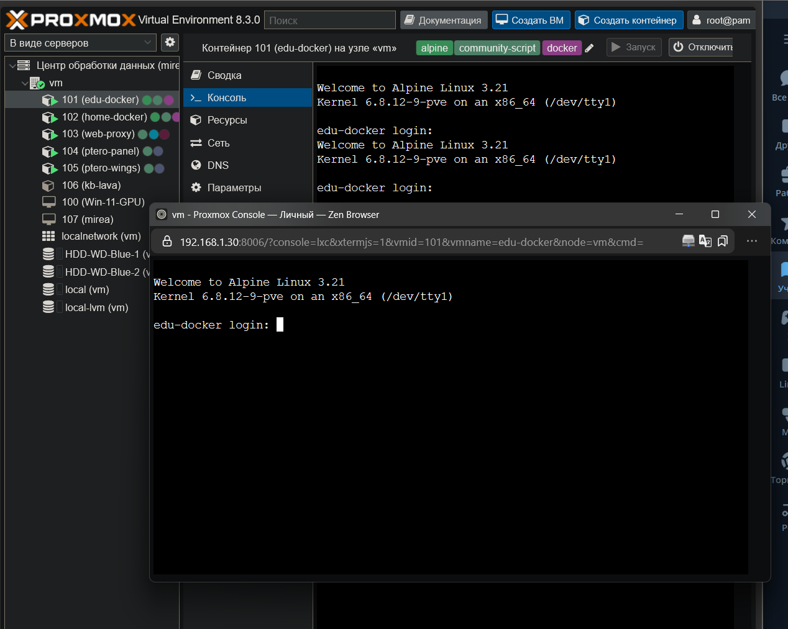

Это очень удобно когда вы настраиваете несколько машин.


## Скачивание и открытие файла с методичкой


---

Для того чтобы открыть файл с методичкой, вам необходимо написать следующую команду:


# 1. Настройте доменный контроллер Samba на машине BR-SRV.

## Первичная настройка DNS для работы с Samba AD:


---

Откройте файл /etc/named.conf:

```commandline
nano /etc/named.conf
```

Внесите в блок `options`, следующие значения параметров (при необходимости, добавив отсутствующие параметры:

```co
 listen-on port 53 { 192.168.1.2; };  
 allow-query { any; };  
 dnssec-validation no;  
 tkey-gssapi-keytab "/var/lib/samba/bind-dns/dns.keytab";  
 minimal-responses yes;  
 forwarders { 8.8.8.8; };  
```

 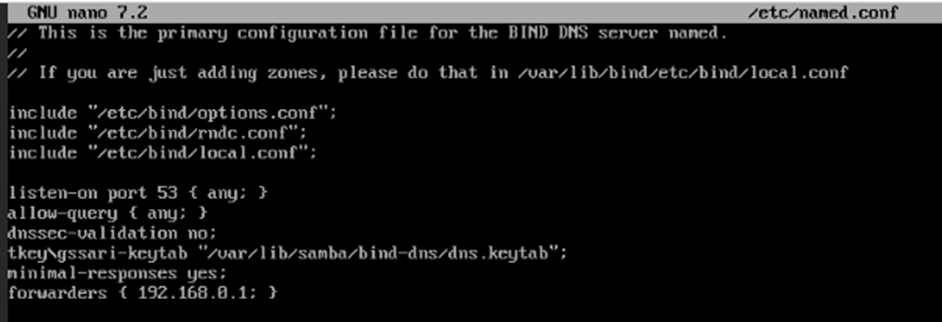


## Настраиваем Samba


---

Удаляем smb.conf и другие конфигурационные файлы и создаём папку:

```shell
rf -f /etc/samba/smb.conf
rm -rf /var/lib/samba
rm -rf /var/cache/samba
mkdir -p /var/lib/samba/sysvol
```

Запускаем автоматическую настройку

```shell
samba-tool domain provision --use-rfc2307 --interactive
```

Задаем все параметры по умолчанию кроме:

* DNS Backend: `NONE` (на скриншоте неверно)
* Administrator password: `P@ssw0rd`
* Retype password: `P@ssw0rd`

После успешной настройки покажет параметры домена.  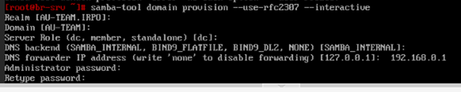  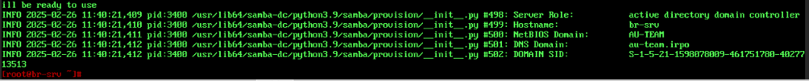

Заходим в smb.conf и добавляем один параметр в самый конец первого заголовка:

```bash
nano /etc/samba/smb.conf
```

```ini
Dns forwarder = 192.168.0.1
```

Запускаем samba и bind с добавлением в автозагрузку.

```shell
systemctl enable --now samba
systemctl enable --now bind
```

Прописываем команду:

```bash
Cp /var/lib/samba/private/krb5.conf /etc/krb5.conf
```


## Настраиваем группу и пользователя


---

Cоздаем группу для пользователей домена:

```shell
samba-tool group add hq
```

Cоздаем пользователей:

```shell
samba-tool user create user1.hq "P@ssw0rd" --home-directory=/home/AU-TEAM/user1.hq --uid=user1.hq
```

Добавляем пользователя в группу

```shell
samba-tool group addmembers hq user1.hq
samba-tool group addmembers hq user2.hq
samba-tool group addmembers "Account Operators" hq
samba-tool group addmembers "Allowed RODC Password Replication Group" hq
```

 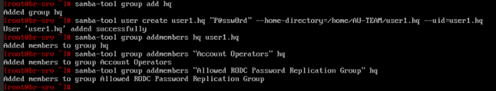

Перезагружаем samba

```bash
systemctl restart samba
```


:::warning
**Перезагружаем сервер!!!**

```bash
reboot
```

:::


## Вводим в домен hq-cli


---

Открываем терминал, через `CTRL+ALT+T`, или меню в левом нижнем углу экрана.

Проверяем настройку в `resolv.conf`

```pro
su -
nano /etc/resolv.conf
```

Проверяем что адрес DNS сервера настроен на Samba AD:

```properties
search au-team.irpo
nameserver 192.168.3.1
```

 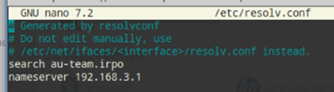

Сохраняем `CTRL + O` и закрываем редактирование файла  `CTRL + X`

Если в файле были сделаны изменения, то перезагрузите систему

```bash
reboot
```

Далее вводим устройство в домен:

```bash
Realm join -U user1.hq au-team.irpo
```


:::info
Запятые в команде - это не ошибка

`-U` - **ОБЯЗАТЕЛЬНО** с заглавной буквы.

:::


Для проверки перезагружаем виртуалку клиента и входим под доменной учетной записью: 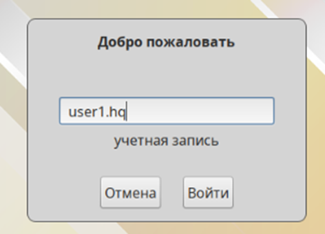

При успешном входе отобразится рабочий стол.


## Настройка политики повышения привилегий (через sudo):


---

Открываем терминал, входим на HQ-CLI под рутом и через команду Echo вписываем параметры в `/etc/sudoers.d/hq`:

```shell
su -
Echo "%hq ALL=(ALL) NOPASSWD:/bin/cat,/bin/grep,/usr/bin/id" > /etc/sudoers.d/hq
```

### Импорт пользователей на сервере BR-SRV:

Создайте скрипт для импорта:

```shell
nano /opt/import_users.sh
```

Пишем

```shell
#!/bin/bash
CSV_FILE="/opt/users.csv"
 while IFS=, read -r username password group; do
  # Создание пользователя
     samba-tool user create "$username" "$password" --home-directory="/home/$username" --uid="$username"
      # Добавление в группу
     samba-tool group addmembers "$group" "$username"
done < "$CSV_FILE" 
```

 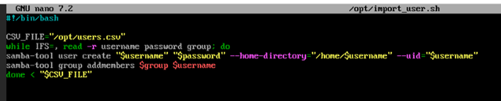

Сделайте скрипт исполняемым:

```shell
chmod +x /opt/import_users.sh
```

Запустите его:

```shell
/opt/import_users.sh
```


# 2. Сконфигурируйте файловое хранилище:


---

Выводим список подключенных дисков и их имена.

```shell
lsblk
```

 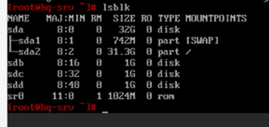

## Создание таблицы разделов


---

Для разбиения диска, запускаем fdisk с именем устройства:

```shell
fdisk /dev/sdb
```

Последовательно выполняем команды: Вводим `g` чтобы создать новую пустую таблицу разделов:

```shell
Command (m for help): g
```

Вводим команду `n` чтобы создать новый раздел:

```shell
Command (m for help): n
```

Будет предложено ввести номер раздела.

* Жмем «Enter», чтобы использовать значение по умолчанию (1)

Далее необходимо указать первый сектор.

* Жмем «Enter», чтобы использовать значение по умолчанию.

При следующем запросе необходимо ввести последний сектор.

* Жмем «Enter», так как используем весь диск

 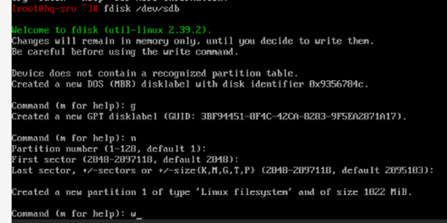

Сохраняем изменения, запустив команду `w`

```shell
Command (m for help): w
```

Команда запишет таблицу на диск и выйдет из меню `fdisk`.Ядро прочитает таблицу разделов устройства без перезагрузки системы.Аналогично создаем разделы на других дисках `/dev/sdc`, `/dev/sdd`

 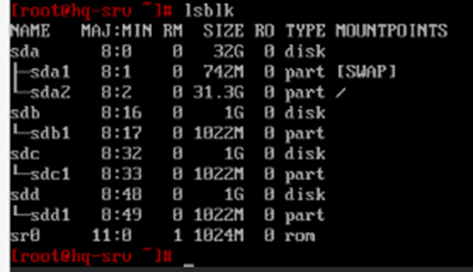

## Создание программного RAID5

Для сборки массива применяем следующую команду:

```shell
mdadm --create --verbose /dev/md0 -l 5 -n 3 /dev/sdb1 /dev/sdc1 /dev/sdd1
```

Система задаст контрольный вопрос, хотим ли мы продолжить и создать RAID — нужно ответить `y`: Мы должны увидеть что-то на подобии:  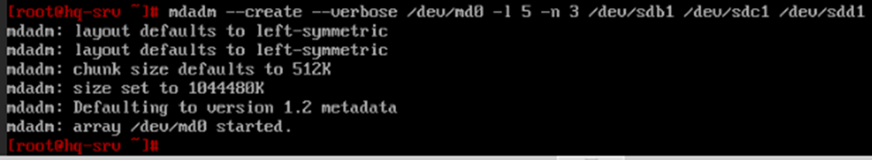

Посмотреть состояние всех RAID можно командой:

```shell
cat /proc/mdstat
```

 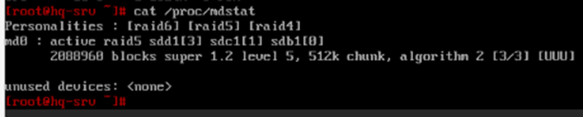

## Монтирование файловой системы массива

Отформатируем разделы в ext4:

```shell
mkfs.ext4 /dev/md0
```

 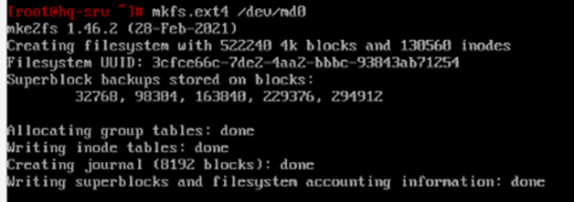

В корне системы создадим директорию /raid5

```shell
mkdir /raid5
```

Примотируем к RAID директорию /raid5 командой:

```shell
mount /dev/md0 /raid5
```

Чтобы разделы монтировались при загрузке системы Открываем fstab:

```shell
nano /etc/fstab
```

И добавляем строки

```shell
/dev/md0    /raid5    ext4    defaults    0    0
```

 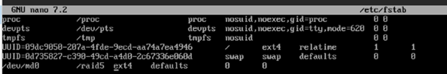

Проверяем примонтированные разделы:

```shell
df -h
```


## Сервер NFS

Создаем папку общего доступа `/raid5/nfs`

```shell
mkdir /raid5/nfs
```

Запускаем nfs сервер:

```shell
systemctl enable -- now nfs
```

Открываем на редактирование файл `/etc/exports` который содержит информацию о каталогах, экспортируемых с сервера:

```shell
nano /etc/exports
```

Создаем шару из каталога `/raid5/nfs`, которая будет доступна для всех узлов сети `192.168.0.64/27` Добавим в него строку:

```shell
/raid5/nfs 192.168.0.64/27(rw,subtree_check)
```

Выполняем экспорт данных (перечитаем конфигурационный файл /etc/exports, чтобы сервер начал отдавать настроенные шары):

```shell
exportfs -a
```

### Автомонтирование

На HQ-CLI устанавливаем компонент для клиентской части NFS: Создаем директорию для автомонтирования `/mnt/nfs`

```shell
mkdir /mnt/nfs
```

Пробуем примонтировать шару:

```shell
mount -t nfs 192.168.100.2:/raid5/nfs /mnt/nfs
```

Для автоматического монтирования на HQ-CLI после перезагрузки, используем `fstab`. Открываем файл `fstab`:

```shell
nano /etc/fstab
```

И добавляем строку:

```shell
192.168.0.2:/raid5/nfs        /mnt/nfs    nfs     auto    0 0
```

 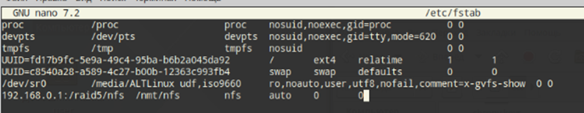

# 3. Настройте синхронизацию времени между сетевыми устройствами по протоколу NTP

Заходим в конфигурационный файл `chrony.conf`

```shell
nano /etc/chrony.conf
```

Приводим конфигурационный файл к следующему виду IP-адреса согласно вашим параметрам, остальные пункты комментировать или удалить!:

```toml
server 127.0.0.1 iburst prefer
local stratum 5
allow 192.168.0.0/26
allow 192.168.0.64/27
allow 192.168.0.96/29
allow 192.168.3.0/27
```

 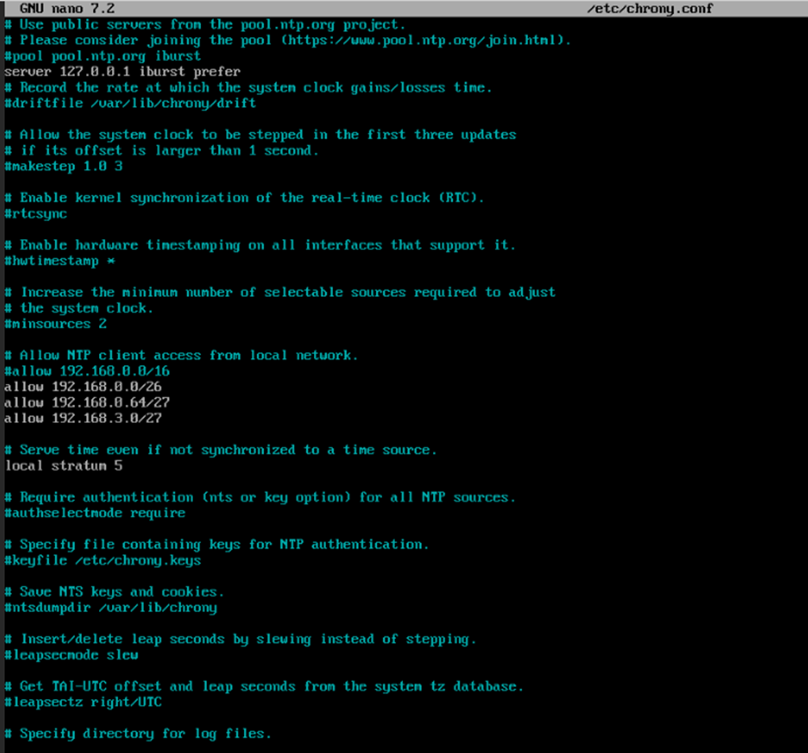

Сохраняем файл и выходим. Запускаем службу синхронизации

```shell
systemctl enable --now chronyd
```

 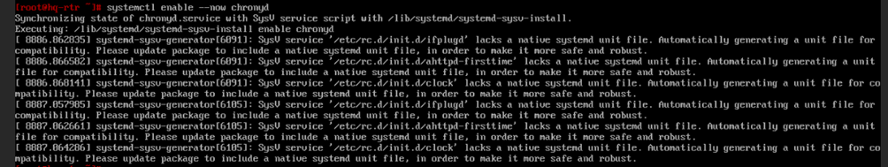

### Настройка NTP клиентов на примере hq-srv br-rtr, br-srv, hq-cli.

Заходим в конфигурационный файл "chrony.conf"

```shell
nano /etc/chrony.conf
```

Приводим конфигурационный файл к следующему виду IP-адреса согласно вашим параметрам, остальные пункты комментировать или удалить!:

```toml
server 192.168.1.62 iburst prefer
```


\
Сохраняем файл и выходим.Запускаем службу синхронизации:

```shell
systemctl enable --now chronyd
```

 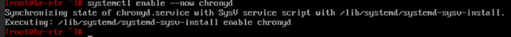

Проверяем

```shell
chronyc sources
```

 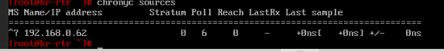

Остальные устройства настраиваем по аналогии с hq-srv.

# 4. Сконфигурируйте ansible на сервере BR-SRV

## Создание пары SSH-ключей. 

Чтобы заходить на удаленные машины, пользователь на BR-SRV (`sshuser` и `root`) должен создать пару из закрытого/открытого RSA ключа. Это делается следующей командой:

```shell
ssh-keygen -t rsa
```

 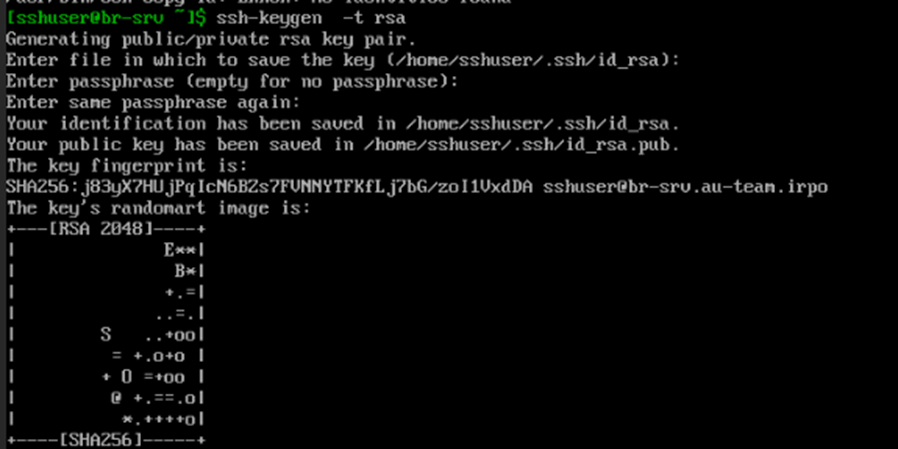

В результате в каталоге `/home/sshuser/.ssh` или `/root/.ssh` будут созданы файлы ключей:

```shell
ls -l ~/.ssh

  id_rsa  # закрытый ключ
  id_rsa.pub # открытый ключ
```

Заходим под пользователем `sshuser` и `root` (выполняется аналогично)

```shell
su - sshuser
```

Копируем открытый SSH-ключ на удаленные устройства под пользователем `sshuser`: Копируем ключ для пользователя `sshuser` на HQ-SRV На HQ-SRV ssh порт изменен, указываем его

```shell
ssh-copy-id -p 2024 sshuser@192.168.0.1
```

 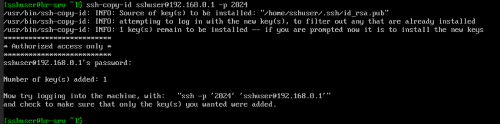

Копируем ключ для пользователя user на HQ-CLI

```shell
ssh-copy-id user@192.168.0.65
```

Копируем ключ для пользователя net_admin на HQ-RTR

```shell
ssh-copy-id net_admin@172.16.4.1
```

Копируем ключ для пользователя net_admin на BR-RTR

```shell
ssh-copy-id net_admin@172.16.5.1
```

## Подготовка файла инвентаря (hosts) 

Создаем файл инвентаря `/etc/ansible/inv`

```shell
nano /etc/ansible/inv
```

Сначала указывается название группы в квадратных скобках, затем перечисляются хосты.Имена хостов прописываются в виде IP.После названия хоста можно указать параметры подключения к хосту в одну строку.

 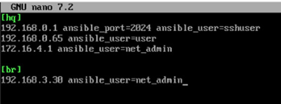


:::tip
**Yablochko076:**

> Малая правка ансибла
>
> У `net_admin` адрес тунеля лучше писать
>
> `10.5.5.1` и `10.5.5.2`, прикопаться могут

:::

Запуск команд с пользовательским инвентарем

```shell
ansible all -i /etc/ansible/inv -m ping
```

Может появиться предупреждение про обнаружение интерпретатора Python, на целевом хосте  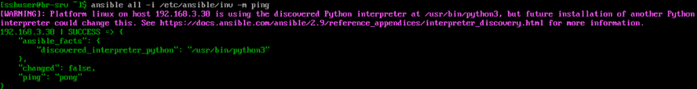

Для управления поведением обнаружения в глобальном масштабе необходимо в файле конфигурации ansible `/etc/ansible/ansible.cfg`

В разделе `[defaults]` прописать ключ `interpreter_python` с параметром `auto_silent`.

В большинстве дистрибутивов прописываем вручную:

```shell
nano /etc/ansible/ansible.cfg
```

```ini
[defaults]
interpreter_python=auto_silent
```

 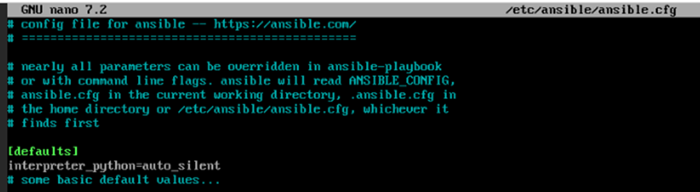

Проверяем

```shell
ansible all -i /etc/ansible/inv -m ping
```

 

# 5. Развертывание приложений в Docker на сервере BR-SRV.

Запустить сервис контейнеризации docker и добавить его в автозагрузку:

```shell
systemctl enable --now docker 
```


Перед настройкой wiki необходимо сменить порт веб интерфейса ЦУС сервера! 

На HQ-CLI открываем браузер в водим адрес https://192.168.3.1 вводим пароль от `root` и заходим в ЦУС 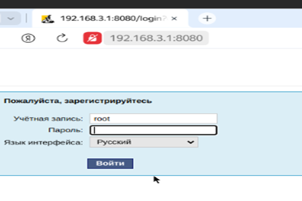


Нажимаем настройка 


Выбираем режим эксперта, применить 


В меню выбираем веб-интерфейс. 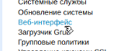


Меняем порт на 8081. 

Нажимаем применить и перезапустить http-сервер.

## Установка MediaWiki


Для упрощения создания `wiki.yml` в поисковой системе на HQ-CLI пишем `mediawiki docker-compose` 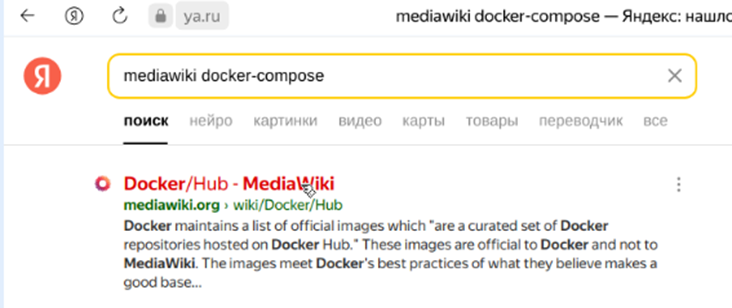

Переходим по ссылке.На странице находим раздел "Adding a Database Server" нажимаем

 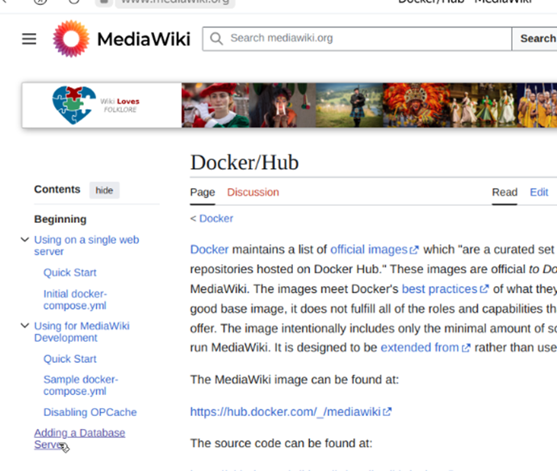

Выделяем код и копируем его

 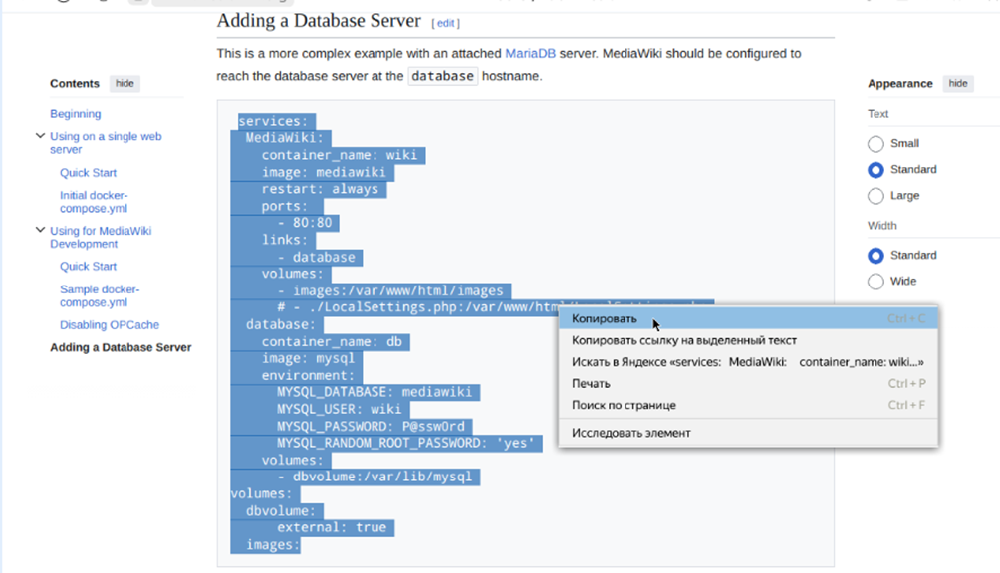

Подключаемся по SSH к BR-SRV с HQ-CLI.

```shell
ssh sshuser@192.168.3.1 -p 2024
```

 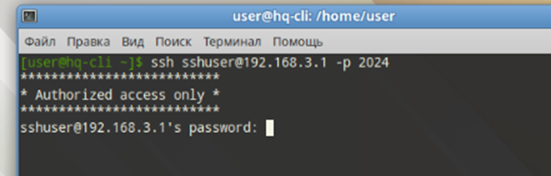 заходим под root

```shell
su -
```

Создаем файл

```shell
nano ~/wiki.yml
```

Вносим изменения в файл:

> Порт: 8080
>
> Имя второго контейнера и его образа: `mariadb`
>
> Имя БД: `mediawiki`
>
> Пользователь БД: `wiki` / `WikiP@ssw0rd`
>
> Изменяем параметр volumes (правим путь)

```yml
services:
  wiki:
    image: mediawiki
    restart: always
    ports:
      - 8080:80
    links:
      - database
    volumes:
      - images:/var/www/html/images
      # - ./LocalSettings.php:/var/www/html/LocalSettings.php
  mariadb:
    image: mariadb
    restart: always
    environment:
      MYSQL_DATABASE: mediawiki
      MYSQL_USER: wiki
      MYSQL_PASSWORD: WikiP@ssw0rd
      MYSQL_RANDOM_ROOT_PASSWORD: 'yes'
    volumes:
      - dbvolume:/var/lib/mariadb

volumes:
  dbvolume:
    external: true
  images:
```

 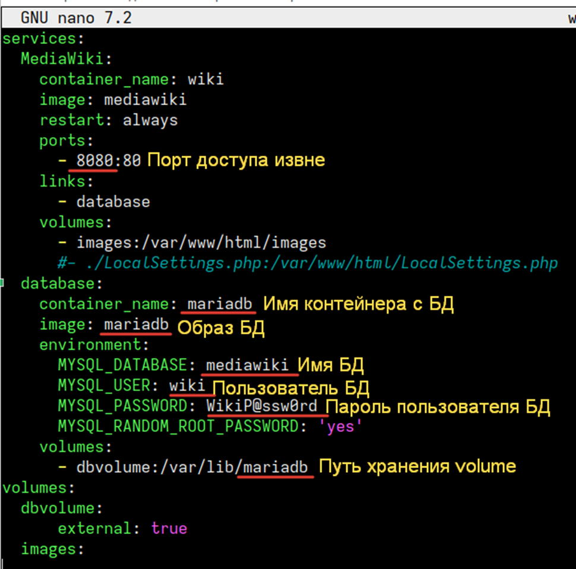

Чтобы отдельный volume для хранения базы данных имел правильное имя - создаём его средствами docker:

```shell
docker volume create dbvolume
```

> Посмотреть все имеющиеся volume можно командой `docker volume ls`

Выполняем запуск стека контейнеров с приложением MediaWiki и базой данных описанных в файле wiki.yml:

```shell
docker compose -f wiki.yml up -d
```

Ждем завершения установки и запуска

  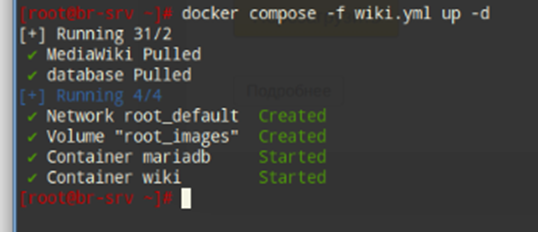

Открываем браузер по адресу нашего сервера http://192.168.3.1:8080

Нажимаем `"set up the wiki"`, приступаем к установке.

 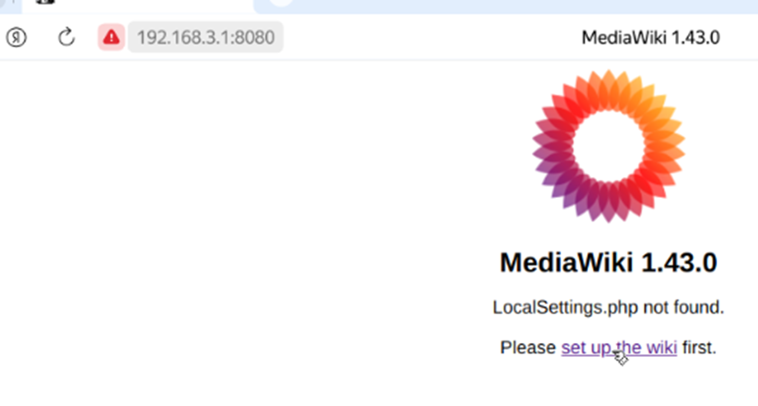

Выбираем русский язык, далее

 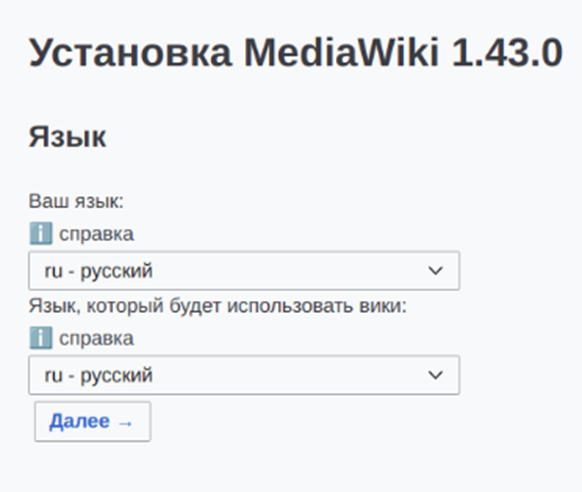

В следующем пункте проверка прошла нажимаем далее

 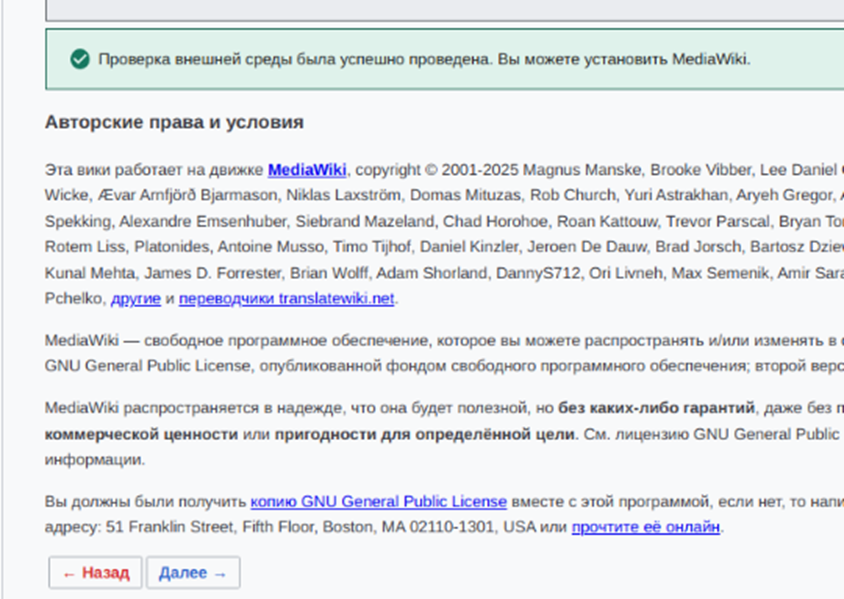

Настраиваем параметры базы данных:

> Хост: `mariadb`
>
> Идентификатор: `mediawiki`
>
> Учетная запись: `wiki` / `WikiP@ssw0rd`


Далее

 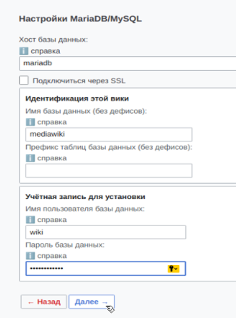

Подтверждаем, далее

 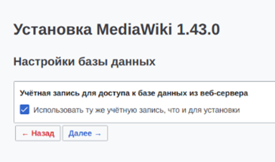

Задаем параметры

> Название — `DemoWiki`
>
> Учетная запись — `wiki` / `WikiP@ssw0rd`
>
> Адрес — `wiki@au-team.irpo`

Выбираем пункт `"хватит уже, просто установить"`

Далее 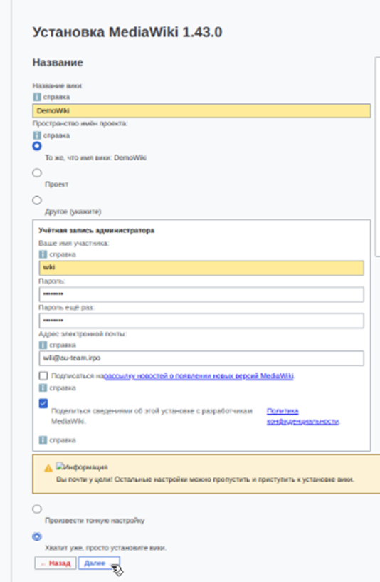


Нажимаем далее 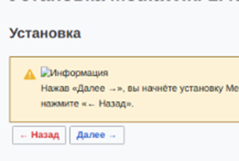


Далее 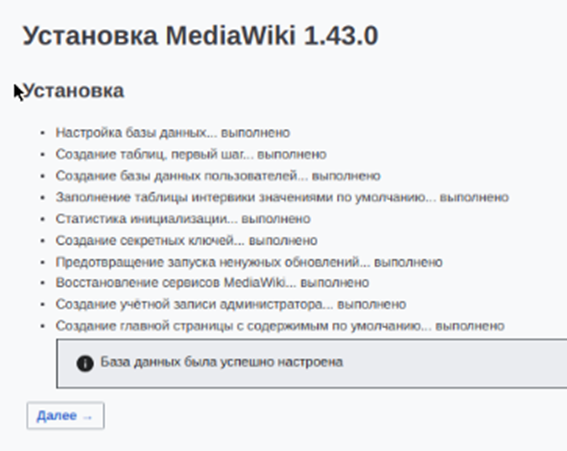

Автоматически скачается `LocalSettings.php`

 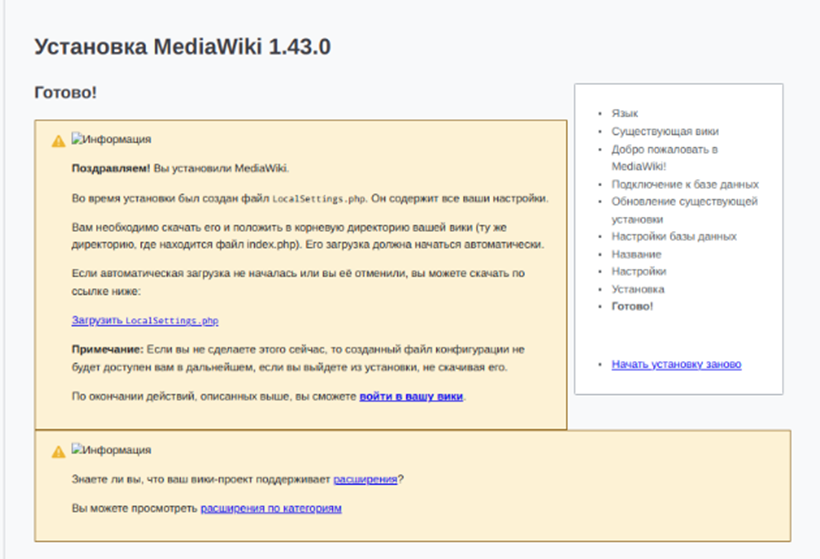

Необходимо передать файл `LocalSettings.php` с HQ-CLI на сервер:

```shell
scp user@192.168.0.65:~/Загрузки/LocalSettings.php ./
```

Раскомментируем строку в файле wiki.yml:

```shell
nano wiki.yml
```

```yml
volumes:
  - ./LocalSettings.php:/var/www/html/LocalSettings.php
```

 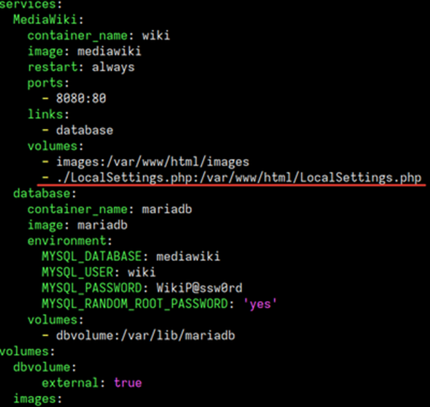

Перезапускаем сервисы средствами docker-compose:

```shell
docker compose -f wiki.yml stop
```

```shell
docker compose -f wiki.yml up -d
```

 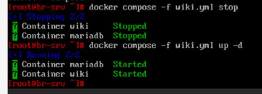

Проверяем доступ к Wiki http://192.168.3.2:8080  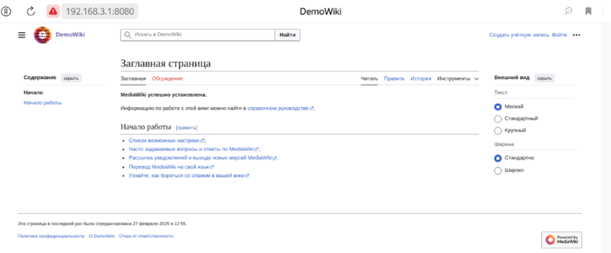

# 6. На маршрутизаторах сконфигурируйте статическую трансляцию портов

На BR-RTR изменяем правило переадресации в таблице `table inet nat`, добавляя `chain prerouting`:

```javascript
chain prerouting {
	type nat hook prerouting priority filter; 
   	ip daddr 172.16.5.1 tcp dport 80 dnat ip to 192.168.3.1:8080
	ip daddr 172.16.5.1 tcp dport 22 dnat ip to 192.168.3.1:2222
}
```

 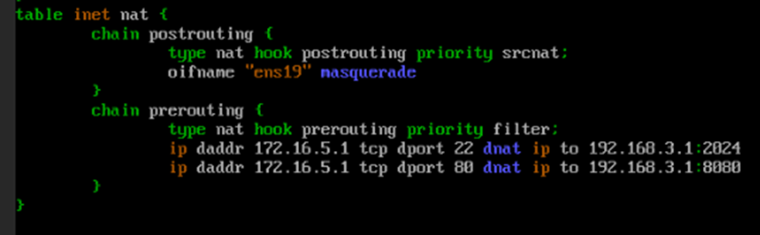

Перезапускаем `nftables`!

```bash
systemctl restart nftables
```

На HQ-RTR изменяем правило переадресации в таблице `table inet nat`, добавляя `chain prerouting`:

```nginx
chain prerouting {
  type nat hook prerouting priority filter; 
  ip daddr 172.16.4.1 tcp dport 22 dnat ip to 192.168.0.1:2222
}
```

 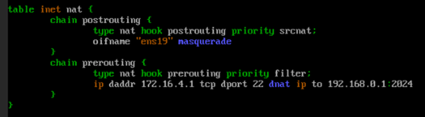

Перезапускаем `nftables`!

```shell
systemctl restart nftables
```

# 7. Запустите сервис moodle на сервере HQ-SRV

Запускаем веб-сервер и добавляем в автозагрузку:

```shell
systemctl enable --now httpd2
```

Включаем и добавляем в автозагрузку MySQL:

```shell
systemctl enable --now mariadb
```

## Подключаемся к MySQL, создаём базу данных и пользователя:

> * Имя базы данных: `moodledb`
> * Имя пользователя: `moodle`
> * Пароль: `P@ssw0rd`

Подключаем модуль `mysql_secure_installation` (tab на этом пункте работает)

* Первый пункт: `Enter`
* Второй пункт: `y`
* Третий пункт: `n`
* Все остальные пункты: `y`

 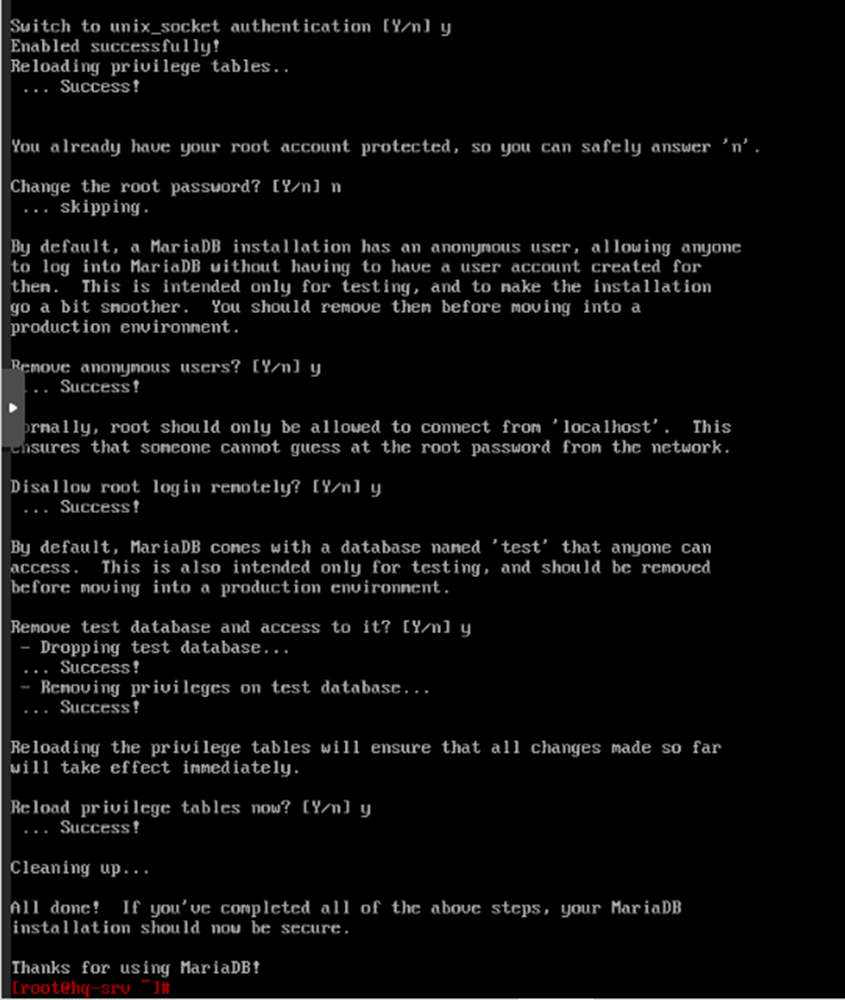

Далее пишем команду:

```shell
mysql -u root -p
```

Вводим пароль от root.  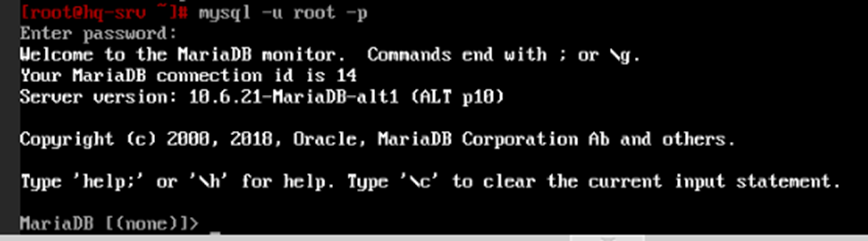

Создаем базу (можно писать все в нижнем регистре (маленькими буквами)):

```sql
CREATE DATABASE moodledb CHARACTER SET utf8mb4 COLLATE utf8mb4_unicode_ci;
CREATE USER 'moodle'@'localhost' IDENTIFIED BY 'P@ssw0rd';
GRANT ALL PRIVILEGES ON moodledb.* TO 'moodle'@'localhost';
FLUSH PRIVILEGES;
EXIT;
```

 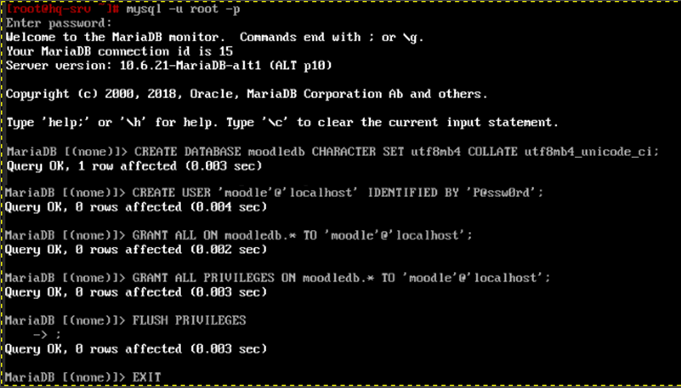

Загружаем код проекта Moodle:

```shell
git clone git://git.moodle.org/moodle.git
```

 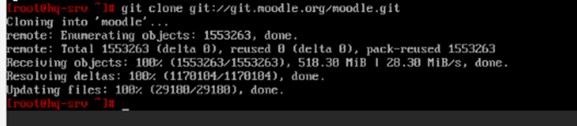

Переходим в загруженный каталог moodle:

```shell
cd moodle
```

Извлекаем список каждой доступной ветви:

```shell
git branch -a
```

 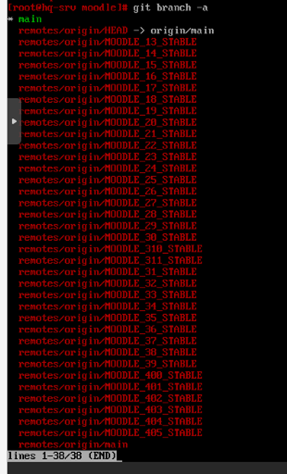

Сообщаем git, какую ветку отслеживать или использовать:

```shell
git branch --track MOODLE_405_STABLE origin/MOODLE_405_STABLE
```

Переключаемся на ветку с нужной версией:

```shell
git checkout MOODLE_405_STABLE
```

 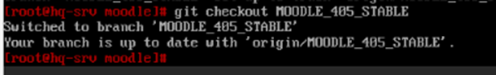

Возвращаемся в корневой каталог:

```shell
cd
```

Копируем локальный репозиторий в `/var/www/html/`:

```shell
cp -R moodle /var/www/html/
```

Создаём необходимую структуру каталогов для корректной установки и работы Moodle:

```shell
mkdir /var/moodledata
```

Назначаем права:

```shell
chmod 777 /var/moodledata
chown -R apache2:apache2  /var/www/html/moodle
chmod -R 755 /var/www/html/moodle
```

Создаем и редактируем конфигурационный файл для веб-сервера Apache:

```shell
nano /etc/httpd2/conf/sites-available/moodle.conf
```

```markup
<VirtualHost *:80>
  ServerName au-team.irpo
  ServerAlias moodle.au-team.irpo
  DocumentRoot /var/www/html/moodle
  <Directory "var/www/html/moodle">
    AllowOverride ALL
    Options =Indexes FollowSymLinks
  </Directory>
</VirtualHost>
```

 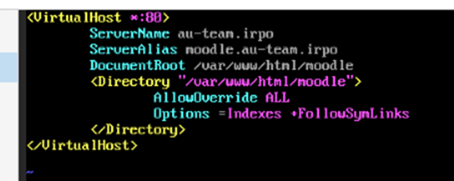

Создаём символьную ссылку из `sites-available` на `sites-enabled`:

```shell
ln -s /etc/httpd2/conf/sites-available/moodle.conf /etc/httpd2/conf/sites-enabled/
```

Проверяем синтаксис файла виртуального хоста:

```shell
apachectl configtest
```

 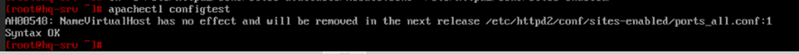

Правим количество входных переменных, которые могут быть приняты в одном запросе. Для работы Moodle - необходимо 5000, а значение в php.ini по умолчанию 1000:

Заходим в конфиг

```shell
nano /etc/php/8.1/apache2-mod_php/php.ini
```


\
Нажимаем `ctrl + _`набираем № строки `389`, нажимаем EnterНаходим строку `max_input_vars` изменяем значение:

* Убираем точку с запятой в начале строки (`;`) и ставим значение 5000

Сохраняем `CTRL + O` и выходим `CTRL + X`

 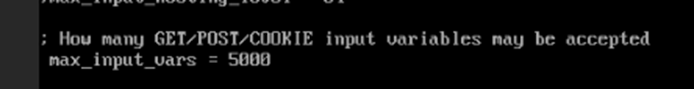

Перезапускаем веб-сервер:

```shell
systemctl restart httpd2
```


Переходим на hq-cli, открываем браузер пишем домен нашего сайта: http://au-team.irpoПопадаем на страницу установки moodle. 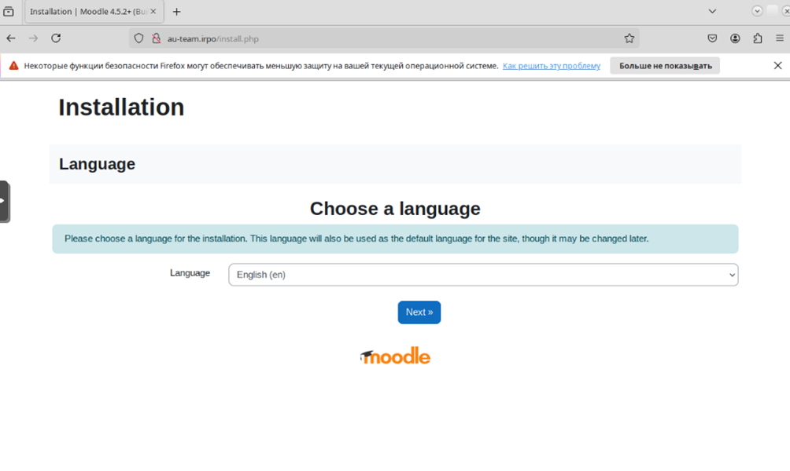

Выбираем язык русский, нажимаем Далее.


Изменяем каталог данных на `/var/moodledata` и подтверждаем пути. 


Выбираем тип базы данных mariadb, подтверждаем. 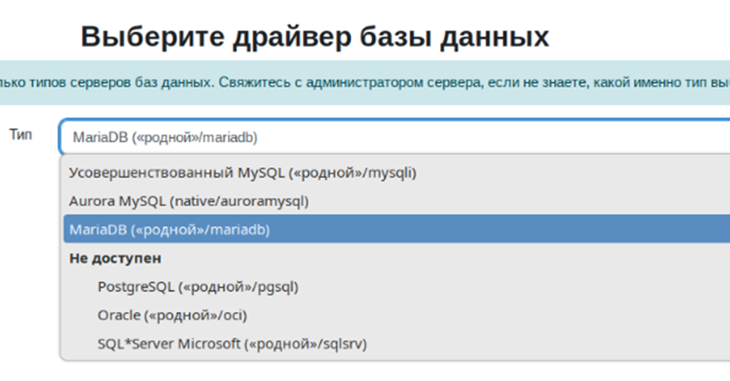


Вносим параметры нашей базы данных, нажимаем Далее 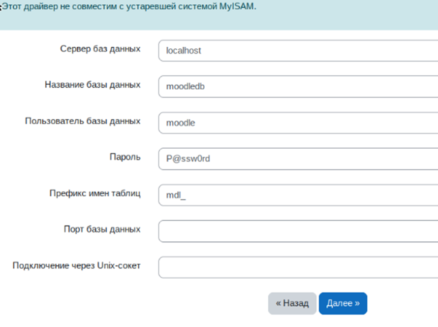


Принимаем лицензию 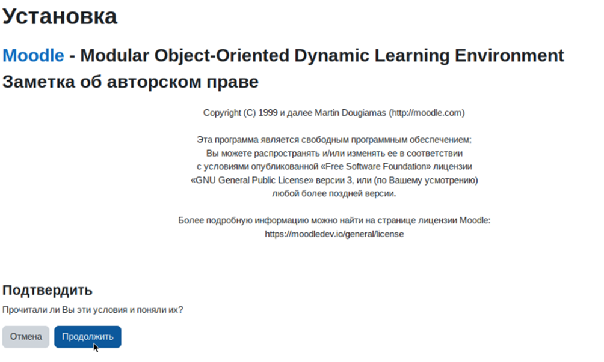


Проверяем настройки сервера (все ок - зеленое) нажимаем продолжить. 


Ждем окончания установки, нажимаем продолжить. 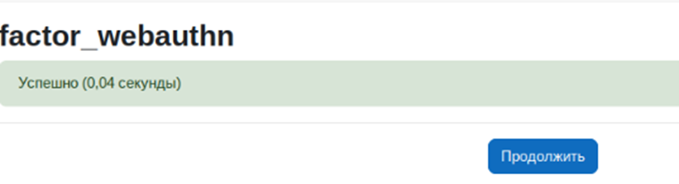


Делаем первичные настройки (пароль - `P@ssw0rd`, Email - `moodle@au-team.irpo`), нажимаем обновить профиль. 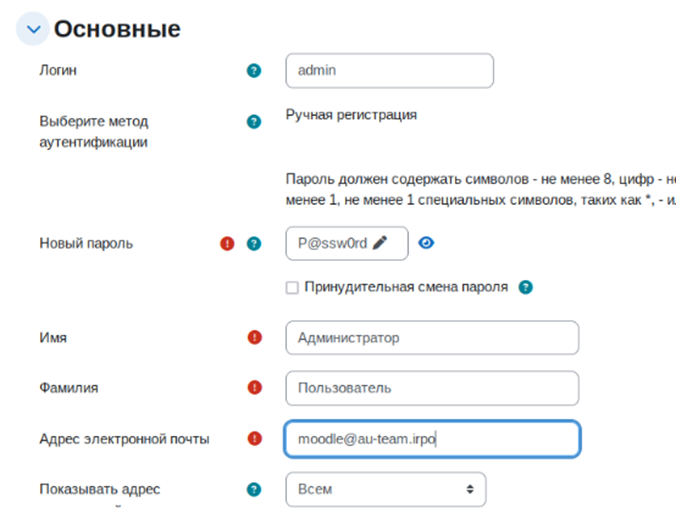


В наименовании сайта задаем номер рабочего места!! 


\
Нажимаем сохранить изменения.Задаем контакт поддержки, сохраняем. 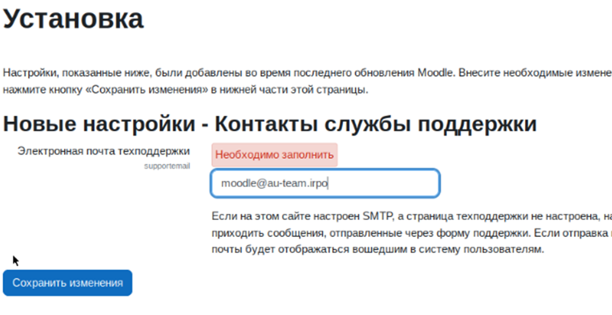

Moodle настроен!

# 8.Настройте веб-сервер nginx как обратный прокси-сервер на HQ-RTR

Выключаем встроенный веб сервер альт линукса!!!

```shell
systemctl disable ahtthd.service
systemctl stop ahtthd.service
```

Запуск и добавление в автозагрузку

```shell
systemctl enable --now nginx
```

Открываем на редактирование конфигурационный файл Nginx

```shell
nano /etc/nginx/nginx.conf
```

Спускаемся в конец HTTP таблицы и перед последней фигурной скобкой `}` прописываем настройки.

```nginx
server {
  listen 80;
  server_name moodle.au-team.irpo;

  location / {
    proxy_pass http://192.168.0.1:80;
  }
}

server {
  listen 80;
  server_name wiki.au-team.irpo;

  location / {
    proxy_pass http://192.168.3.1:8080;
  }
}
```

Перезагружаем Nginx

```shell
systemctl restart nginx
```

 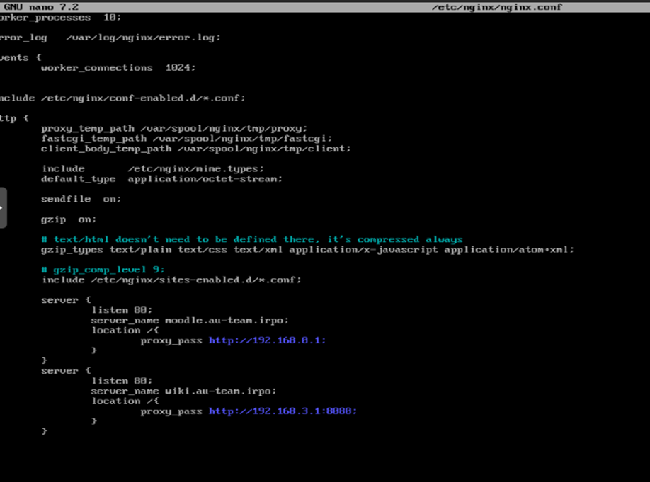

# 9. Установить яндекс браузер на CLI.

Заходим в терминал под root, обновляем репозитории:

```shell
su -
apt-get update
```

Устанавливаем яндекс браузер:

```shell
apt-get install yandex-browser-stable -y
```

 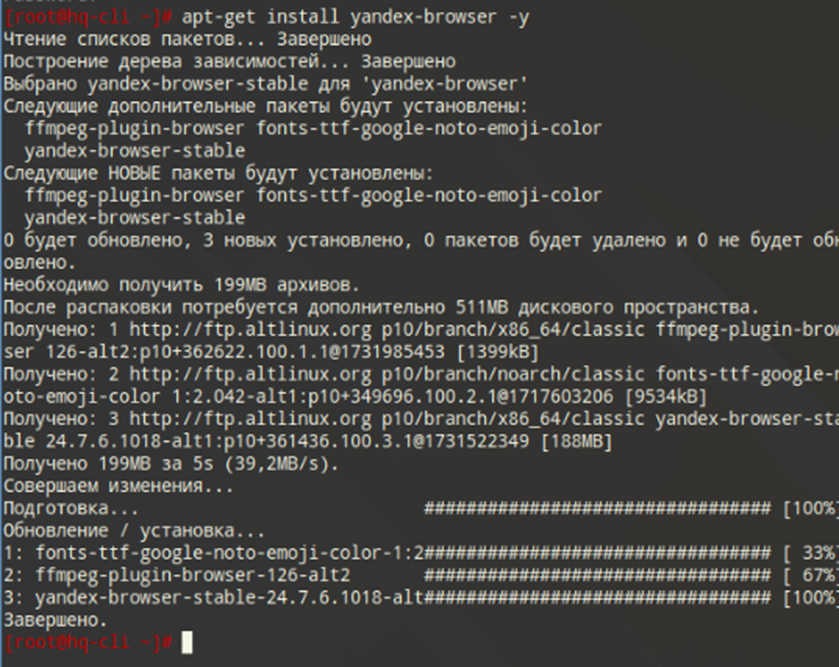

Заходим в `Меню` -> `Все программы` -> `Интернет` -> `Yandex Browser` Нажимаем правой кнопкой мыши -> `"Добавить на рабочий стол"`  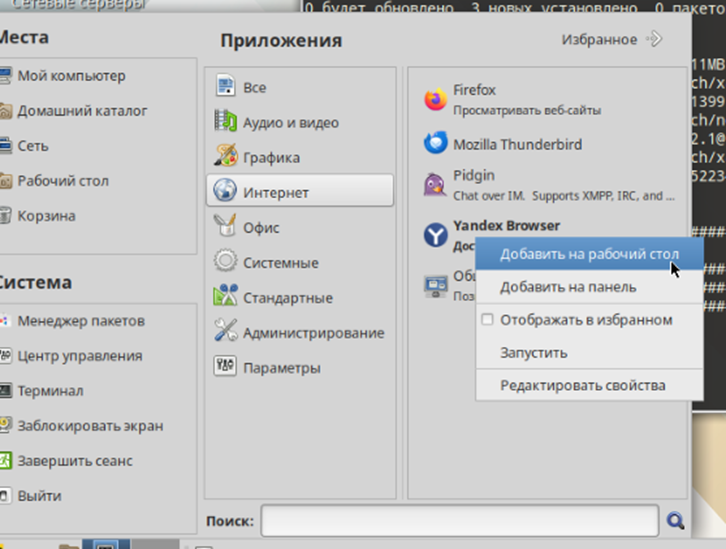

Готово!!!


# БЛАГОДАРНОСТИ

На случай, если данный материал обнаружат служители колледжа КПК МИРЭА и отсутствия в следствии проблем у людей, о которых говориться в этом сегменте, имена были заменены на многим известные никнеймы.


:::tip
**Уважаемый Ramen!**


Хочу выразить Вам искреннюю благодарность за неоценимую помощь в написании методических указаний к демо-экзамену. 

Ваши знания и опыт стали для меня ценным ресурсом, и я очень ценю время и усилия, которые Вы вложили в этот проект.


Ваши рекомендации и конструктивные предложения значительно улучшили качество методических указаний. Благодаря Вашему вниманию к деталям и глубокому пониманию предмета, мы смогли создать документ, который будет полезен как преподавателям, так и студентам. Я особенно признателен за Вашу готовность делиться своими идеями и подходами, что позволило нам рассмотреть различные аспекты организации экзамена и сделать его более прозрачным и доступным.


Ваш профессионализм и преданность делу вдохновляют меня и моих коллег. Я надеюсь на дальнейшее сотрудничество и уверен, что вместе мы сможем достичь еще больших успехов.


**Еще раз спасибо за Вашу поддержку и помощь.** 

:::


:::tip
Хочу выразить огромную благодарность всей команде **"Майской Революции"**

Их сплочённость и внимательность позволила мне разработать данную методичку.


Благодаря ним, данный материал может развиться из обычной шпаргалки к Экзамену в документацию к самому ДЕМО экзамену!


🥇Благодарю золотых спонсоров данного материала - Мимимишного "**Ramen"** и Умнейшего "**Hideyoshu"**!


📝Также благодарю и тех, кто участвовал в сборе информации - Мощный "**adsarf"**, Независимый "**Yablochko076",** 


🎉И за моральную поддержку - Изысканный "**W.R. D.R."**, Анимешный "**Ozavrr**", Умная "**HastyaRe**", Теоретический "**cherni chayok**", Скрытный "**panpan**"


Ваш вечный слуга, 🥕 **DSvinka**

:::